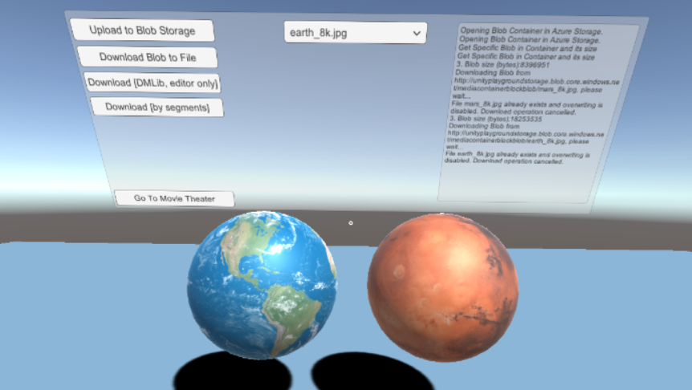

# AzureStorageDemoUnity3D
Sample Unity project used to demonstrate the use of [Azure Storage](https://azure.microsoft.com/services/storage/) services in games and Mixed Reality projects. This app shows how you can upload/download blobs from Azure Storage using the basic Azure Storage SDK, and you also get the ability to download blobs by segments of 1MB (configurable) which opens the door for tracking progress during the download. This allows you to dynamically load large media files from the cloud at runtime, such as high-resolution textures, HD videos and even panoramic 360 degrees videos.

* **Unity version: 2017.4.5f1**
* **Mixed Reality Toolkit version: 2017.2.1.1**

# Demo Scenes

* **AzureBlobStorageTest**: Simple scene to demonstrate how to upload & download files to/from Azure Blob Storage, showcasing the Azure Transfer ProgressBar and the debug window. The spheres demonstrate the use of the *BlobStorageTextureDownloader* script.

* **AzureBlobStorageVideoTest**: Simple movie theater scene used to play video files downloaded from Azure Blob Storage. Press the Play button to start the first video clip, and use the Skip button to queue-up the next video clip. Selecting the soccer ball loads a 360 degrees panoramic video from Azure Storage and uses it as a skybox, lifting the theater walls to reveal the outdoors. Sample videos are provided in the *StreamingAssets* folder, and you can use the *AzureBlobStorageTest* scene to upload your videos to blob storage before using them in this scene.

## Implementation Notes

* **Azure Storage**: You will need an [Azure Storage](https://azure.microsoft.com/services/storage/) account to run this demo. My Azure Storage key is included in the project but I reserve the right to remove/change it at any time. Simply create a new Azure Storage account using these [quickstart instructions](https://docs.microsoft.com/en-us/azure/storage/blobs/storage-quickstart-blobs-portal), create a blob container named "mediacontainerblockblob" and copy your connection string in the *AzureBlobStorageClient* script.
* **Scripting backend**: This project requires the .NET Scripting backend and support for .NET 4.6 Experimental in Unity. This sample has not been tested with IL2CPP yet.
* **Configuration Prefab**: Use the *AzureBlobStorageManager* prefab in your scene since it contains the main *AzureBlobStorageClient* script & proxy class you need to quickly integrate Azure Blob Storage in your projects. Set your Azure Storage connection string and blob container name here.
* **SSL/TLS Limitation**: When running in the editor you CANNOT use https to connect to Blob Storage due to a certificates limitation in Unity, but https works fine in the UWP build. The *AzureBlobStorageClient* script includes a checkbox to enable this http/https toggle automatically for you.
* **Plugins**: The plugin DLL files are included in the source since they are specific versions selected for this project based on compatibility. The [Azure Storage DLL](https://www.nuget.org/packages/WindowsAzure.Storage/) is the Win8 version for the UWP build, and the .NET 4.5 version for the Unity editor.
* **Data Movement Library (Editor-only)**: There is an extra button in the *AzureBlobStorageTest* scene that showcases a blob download example script using the [Azure Storage Data Movement library](https://www.nuget.org/packages/Microsoft.Azure.Storage.DataMovement). While it currently runs fine in the Unity editor, note that the UWP build export doesn't work. This is because Unity cannot handle a 16299 UWP DLL (which is UWP v6, Unity can only produce v5), so it was decided to shelve DMLib for now until Unity 2018.1 adds support for .NET Standard 2.0.
* **Sister Project**: If you want to dig into the techniques used for Azure Storage in this Unity demo, check out the sample [UWP XAML Test Client for Azure Storage here](https://github.com/ActiveNick/AzStorageDataMovementTest) by Nick Landry.
* **Movie Theater Lighting**: All the spotlights in the movie theater are set to *Not important* and use baked lighting. However, the walls and ceiling are not static since they need to be lifted. For that reason, lighting auto-generation is turned off. If you load the project and the theater walls are showing a uniform blue without any spotlight effect (see screenshot for what it should look like), set the ceiling, walls (and children) to *Static*, manually generate your lightmap, and then disable the *Static* flag on the ceiling, walls (and children) again.

## Known Issues

* While this project includes two scenes with a transition button allowing the user to navigate from the first to the second scene, there are issues with the transition still being worked out (see below). It is therefore recommended to treat both scenes as individual scenes rather than part of a whole (for now).
* *The scene transition is messed-up in UWP*. In the Unity editor, the scene transition works fine. In a UWP build, the scene isn't rendered properly and the whole world is purple, with the cursor still visible in the empty world.
* *The controllers don’t transition well*. During a scene transition the camera position resets properly, but the controllers do not. They remain at the last known location in the previous scene.

## Acknowledgements

* The Movie Theater scene used some components and scripts from the excellent [Unity Graphics Live Training: Playing Video in Unity](https://unity3d.com/learn/tutorials/topics/graphics/introduction-and-session-goals?playlist=17102) as a starting point. If you want to learn more about video integration in Unity world space, I recommend you watch this video series.
* The planetary texture maps were downloaded from [Solar System Scope](https://www.solarsystemscope.com/textures), and are based on NASA elevation and imagery data. Solar System Scope license statement: *"Distributed these textures under Attribution 4.0 International license: You may use, adapt, and share these textures for any purpose, even commercially"*.

## Reference Links
* [Azure SDKs for Game Developers](https://docs.microsoft.com/sandbox/gamedev/)
* [Azure Solutions for Gaming](https://azure.microsoft.com/solutions/gaming/)
* [Azure Storage API Docs for .NET](https://docs.microsoft.com/en-us/dotnet/api/overview/azure/storage?view=azure-dotnet)
* [Microsoft Azure Storage team's blog](http://blogs.msdn.com/b/windowsazurestorage/) 

